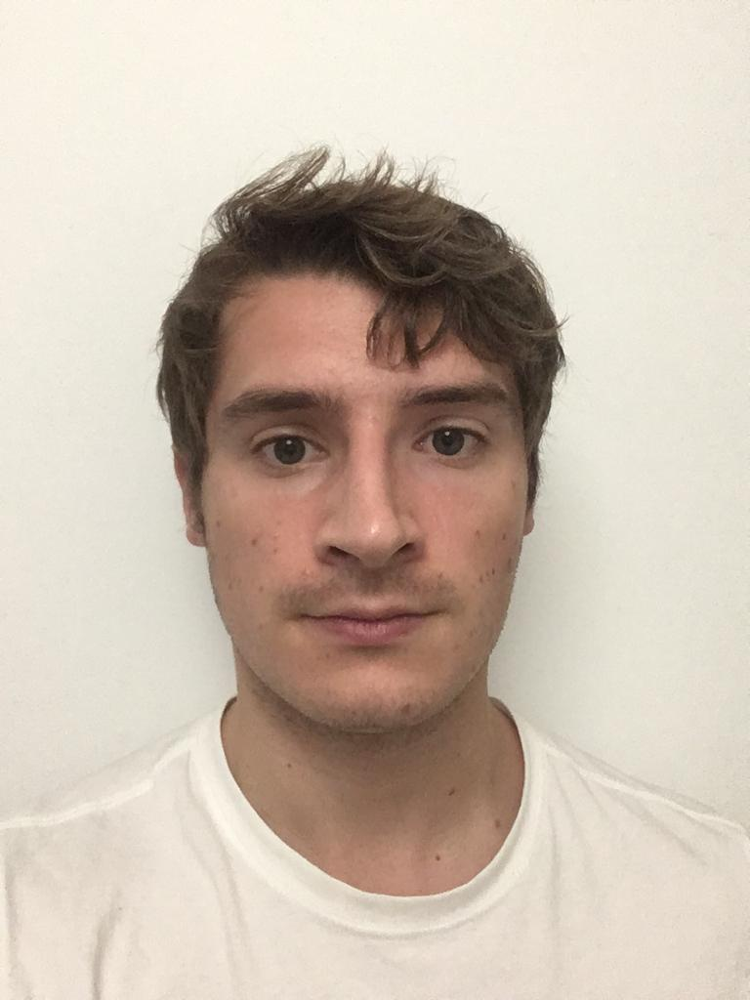
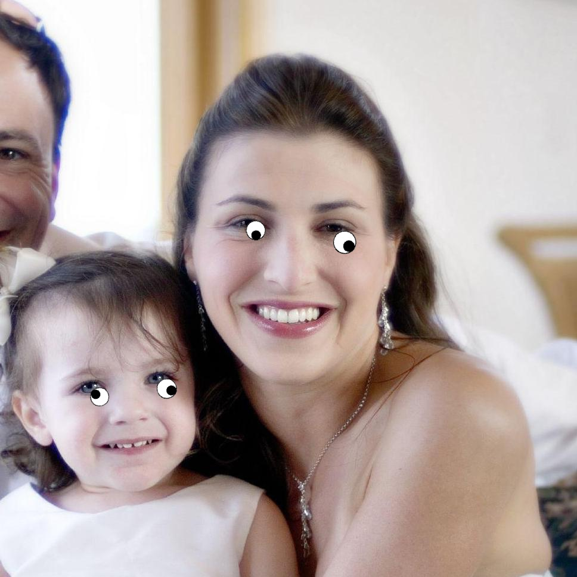
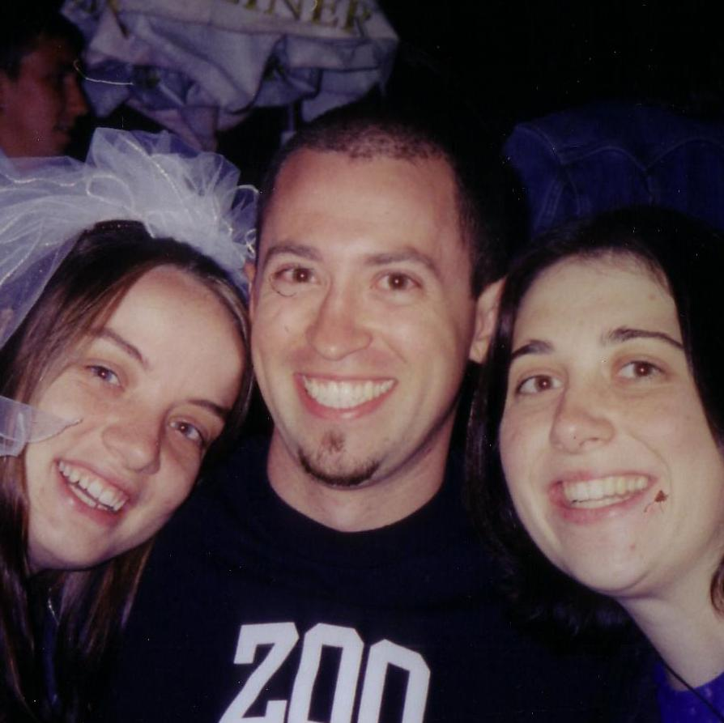
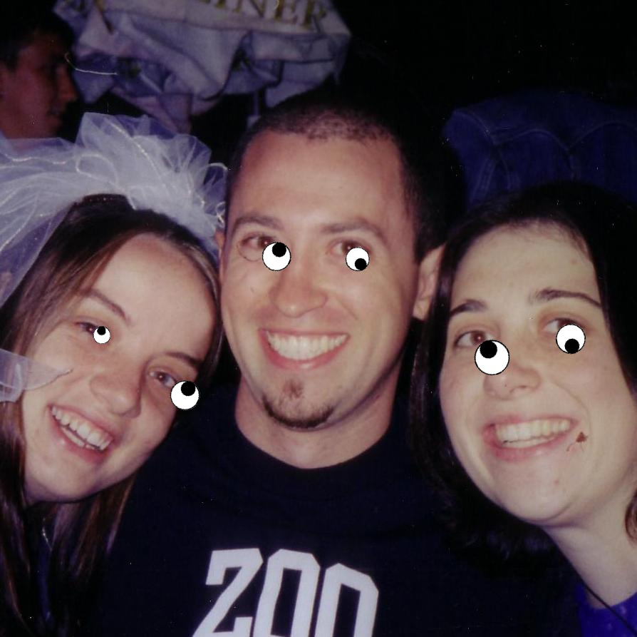

# googlyeyes

A lightweight web application which adds googly eyes to an image sent to its `POST /imageUpload` endpoint.

 `POST` payload                       | Response body                               | Faces
:------------------------------------:|:-------------------------------------------:|:-----------:
  |  | `n_faces=1`
  |  | `n_faces=2`
  |  | `n_faces=3`

## Installation & Usage

Install in editable mode using pip:

```bash
cd googlyeyes/
conda create -n googlyeyes-env -c conda-forge python=3.6 coverage flake8 Flask Flask-RESTful imutils dlib opencv numpy pytest requests
conda activate googlyeyes-env
pip install -e .
```

## Building the docker image

```bash
docker build -t googlyeyes-app .
```

## Run unit and regression tests

You can then run the application using:

```bash
docker run -d -p 5000:5000 googlyeyes-app
pytest
```

## Facial coordinate points

68 facial coordinate points from the iBUG 300-W dataset.

## Credits

* Credits to [pyimagesearch](https://www.pyimagesearch.com/2017/04/03/facial-landmarks-dlib-opencv-python/) for the code to find the facial landmarks.
* Credits to [sagaragarwal94](https://github.com/sagaragarwal94/python_rest_flask) for his simple webserver API using Flask.
* Credits to [fireant](https://stackoverflow.com/users/1334399/fireant) for his StackOverflow [answer](https://stackoverflow.com/questions/14063070/overlay-a-smaller-image-on-a-larger-image-python-opencv) on overlaying a PNG image with OpenCV.
* Credits to the [Helen dataset](http://www.ifp.illinois.edu/~vuongle2/helen/) which was used for testing.
